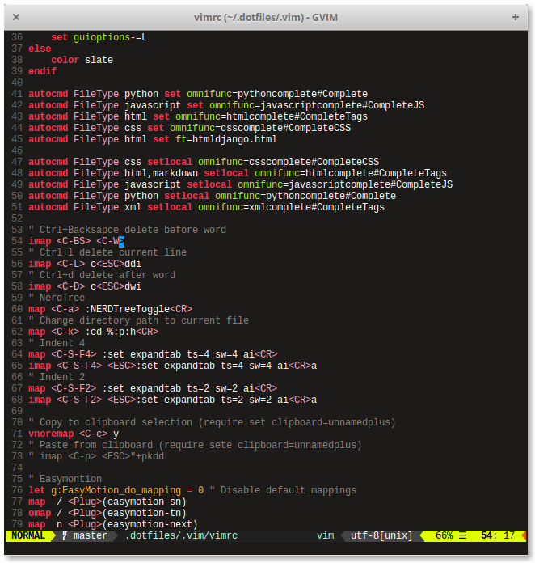

# Dotfiles

Este repositorio contiene las configuraciones necesarias para mi trabajo diario.  Si crees que pueden servirte, siéntete libre de  tomarlas, forkearlas, e incluso, atrévete a sugerirme nuevas herramientas, configuraciones o plugins.

## Vim

Lista de Plugins:

1. [Emmet](https://github.com/mattn/emmet-vim)
2. [Neocomplcache](https://github.com/Shougo/neocomplcache.vim)
3. [Nerdtree](https://github.com/scrooloose/nerdtree)
4. [Snipmate](https://github.com/garbas/vim-snipmate)
5. [Tabular](https://github.com/godlygeek/tabular)
6. [Tagbar](https://github.com/majutsushi/tagbar)
7. [Airline](https://github.com/bling/vim-airline)
8. [Autoclose](https://github.com/Townk/vim-autoclose)
9. [Easymotion](https://github.com/Lokaltog/vim-easymotion)
10. [Fugitive](https://github.com/tpope/vim-fugitive)
11. [Gitgutter](https://github.com/airblade/vim-gitgutter)
12. [VIM Multiple Cursors](https://github.com/terryma/vim-multiple-cursors)
